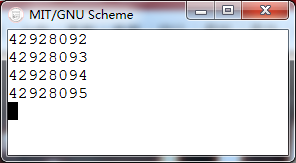

# Codes
    (define (xysqrt in)
      (sqrt-iter 1.0 in))
    
    (define (sqrt-iter guess x)
      (new-if (good-enough? guess x)
          guess
          (sqrt-iter (improve guess x) x)))
    
    (define (new-if pred if-then if-else)
      (cond (pred if-then)
            (else if-else)))
    
    (define (improve g b)
      (/ (+ g
            (/ b g))
         2.0))
    
    (define (good-enough? c d)
      (< (abs (- (square c)
                 d))
         0.001))
    
    (define (square x)
      (* x x))

# Running
    1 ]=> (load "1006_b.scm")
    
    ;Loading "1006_b.scm"... done
    ;Value: square
    
    1 ]=> (xysqrt 4)
    
    ;Aborting!: maximum recursion depth exceeded

# Analyzing
运行结果显示："Aborting!: maximum recursion depth exceeded"，是因为递归深度超过了scheme的限制。

## Recursion depth
这里有一段测试Scheme recursion depth limit的方法：
### Codes
    (define (recurse number)
      (begin (display number) (newline) (recurse (+ number 1))))
     
    (recurse 1)
### Running
在Win7、64位系统、4G内存下执行了近5个小时，递归深度已经达到了1亿多次了(如下图)，但是丝毫没有要停的意思...看来这个测scheme recursion depth的方法不太可行。

### Analyzing
recurse这个方法每次运行时，就显示是第几次执行recurse、换行、调用recurse，所以通过输出的数字就是recurse这个递归方法运行时的递归深度。

## sysqrt 的递归深度为什么会超过scheme的限制

    (define (sqrt-iter guess x)
      (new-if (good-enough? guess x)
          guess
          (sqrt-iter (improve guess x) x)))
